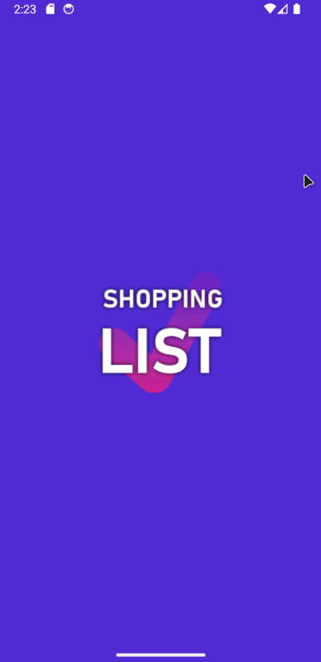

# The Shopping List Project

This repository contains a simple, minimalist shopping list Android app written in C# using .NET 8 MAUI, the
CommunityToolkit, and SQLite. It was my first attempt to create an app and use .NET MAUI. The goal was to learn about
.NET MAUI cross-platform development, Android app development, and to build something semi-useful.



_(The mouse capture is a little offset for some reason and some page transitions are choppy because of the emulator.)_

## Features

* An app containing a *single* shopping list with a minimalist design
* The list indicates quantity, where to buy an item, and whether or not an item is important
* Store names can be configured (optional)
* A list can be exported to the clipboard as text
* A list can be imported from a comma-separated string from the clipboard and merged with the current list
* All data is stored in a SQLite database on the device
* Native confirmation prompts are used for destructive actions
* A styled welcome popup is shown (only) on first launch
* Icons used are CC0 from [iconsDB.com](https://www.iconsdb.com/)

## How to build the APK

Create APK with:

```shell
dotnet publish -f:net8.0-android -c:Release /p:AndroidSdkDirectory=path_to_sdk
```

For example:

```
dotnet publish -f:net8.0-android -c:Release /p:AndroidSdkDirectory=C:\Users\{user}\AppData\Local\Android\sdk
```

APK file can then be found in `bin\Release\net8.0-android\publish\` and installed directly on any Android phone.