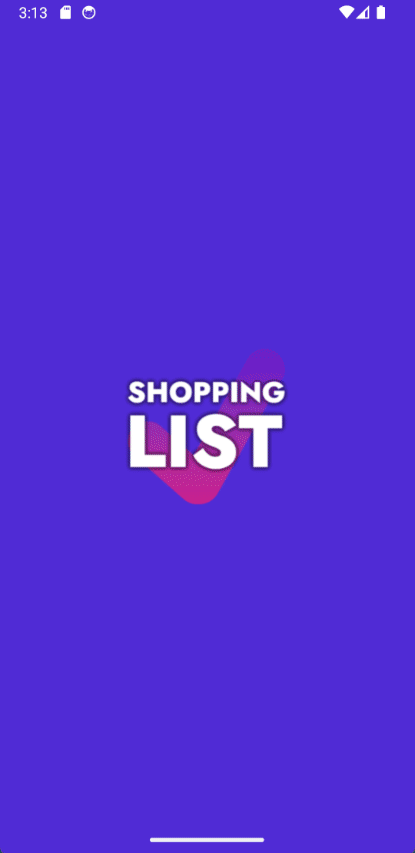

# The Shopping List Project

This repository contains a simple, minimalist shopping list Android app written in C# using .NET 8 MAUI, the
CommunityToolkit, and SQLite. The project uses Appium and NUnit for UI testing. It was my first attempt to create an 
app and use .NET MAUI. The goal was to learn about .NET MAUI cross-platform development, Android app development, and 
to build something semi-useful.



## Features

* An app containing a minimalist shopping list
* The list indicates quantity, where to buy an item, and whether or not an item is important
* Store names can be configured (optional)
* A list can be exported to the clipboard as text
* A list can be imported from a comma-separated string from the clipboard and merged with the current list
* All data is stored in a SQLite database on the device
* Native confirmation prompts are used for destructive actions
* A simple welcome popup is shown on first launch
* A dark theme is available
* Icons used are CC0 from [iconsDB.com](https://www.iconsdb.com/)

## How to build the APK

Create APK with:

```shell
dotnet publish -f:net8.0-android -c:Release /p:AndroidSdkDirectory=path_to_sdk
```

For example:

```shell
dotnet publish -f:net8.0-android -c:Release /p:AndroidSdkDirectory=$env:ANDROID_HOME
```

This assumes that the Android SDK is installed and the `ANDROID_HOME` environment variable is set.

APK file can then be found in `bin\Release\net8.0-android\publish\` and installed directly on any Android phone.


## How to run tests

1. Start an Android emulator or connect an Android device
2. Run Appium server with `appium`
3. Run tests with `dotnet test`

